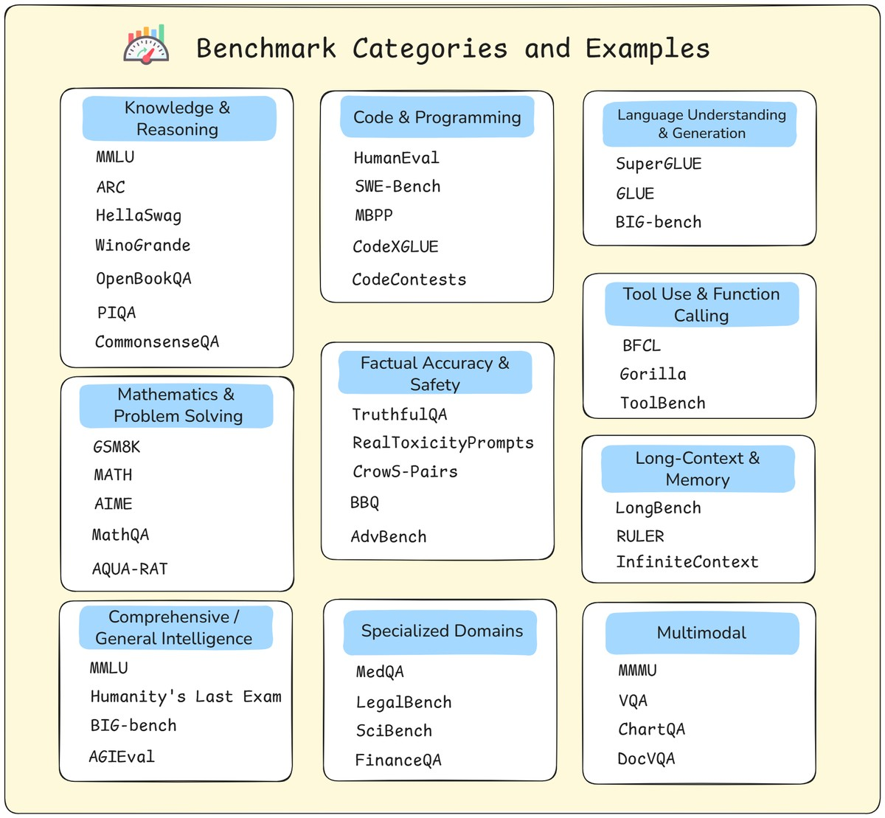

# Lesson Notes: Choosing the Right LLM

This lesson explains how to strategically select a base model for fine-tuning. This is one of the most important decisions in an LLM workflow because fine-tuning is expensive and difficult to undo.

The goal is not to pick the #1 ranked model, but to find the best model for **your specific task, constraints, and infrastructure**.

## The Two-Step LLM Selection Process

A systematic process for choosing a model involves two main steps:

### Step 1: Check Infrastructure Constraints

Before looking at any benchmarks, first assess your hardware. Your available **GPU memory (VRAM)** is the primary factor that determines what model sizes are realistic for you to run.

* **Model Size:** Measured in parameters (e.g., 7B, 13B, 70B).
* **Memory Needs:** A model's size directly impacts the VRAM needed. Using long context windows (e.g., for RAG) can also significantly increase memory requirements by 30-40% or more.

| Model Size | Inference Memory Needed | Works On |
| :--- | :--- | :--- |
| 1B-3B | ~3-10 GB | Consumer GPU (12-16GB) |
| **7B-8B** | **~18-20 GB** | **Professional GPU (24GB)** |
| 13B-20B | ~32-36 GB | Enterprise GPU (40GB) |
| 30B-70B | ~75-190 GB | Multi-GPU A100 setup |

This step immediately filters out models that are too large for your hardware.

**Golden Rule:** Start with the **smallest model** that meets your performance needs. A well-tuned 7B model often beats a poorly configured 70B one.

### Step 2: Use Benchmarks to Compare Models

Once you have a viable size range (e.g., "7B models"), you use benchmarks to compare them.

**Key Principle:** Fine-tuning **refines existing skills**—it does not invent new ones.

Therefore, you must choose a base model that is *already* strong in your target domain.
* **Building a code assistant?** Check scores on **HumanEval** or **SWE-Bench**.
* **Need a reasoning system?** Focus on **BBH** and **MATH**.
* **Need instruction-following?** Look at **IFEval**.
* **Need factual accuracy?** Check **TruthfulQA**.

---

## Making Sense of LLM Benchmarks and Leaderboards

### What is a Benchmark?

A benchmark is a standardized test. Models are given a set of questions, and their outputs are scored to compare performance.

* **Static Benchmarks:** These test knowledge and reasoning against reference answers. Examples include:
    * **MMLU:** Measures broad academic knowledge.
    * **GSM8K:** Tests multi-step grade-school math reasoning.
    * **HumanEval:** Tests Python coding ability.
    * **TruthfulQA:** Measures a model's resistance to generating false information.
* **Human Preference:** These benchmarks measure how "good" a model *feels* to a human user.

### What are Leaderboards?

Leaderboards simply turn benchmark scores into rankings. There are three main types to consult:

1.  **Hugging Face Open LLM Leaderboard:**
    * This is the standard for **open-weight models**.
    * It aggregates scores from several key static benchmarks (MMLU, ARC, HellaSwag, etc.) into an average score.

2.  **Vellum Leaderboard:**
    * This leaderboard tracks newer, "non-saturated" benchmarks to get a more modern look at model performance.
    * It also helps bridge the gap from public data to real-world workflows.

3.  **Chatbot Arena:**
    * This is the most important leaderboard for measuring **user preference and "feel"**.
    * It's a blind test where users are shown responses from two anonymous models and vote for which is better.
    * This captures qualities like tone, clarity, and helpfulness that static tests miss.

### How to Interpret Leaderboards Wisely

Never just pick the #1 model. Use leaderboards as a *filter* to shortlist candidates.

1.  **Dig Deeper:** Don't just look at the average score. A model might be #1 overall but have a very low `TruthfulQA` score, making it bad for a support bot.
2.  **Consider Deployment Realities:** Check the model's size, license (can you use it commercially?), and latency. These are often more important than a small score difference.
3.  **Run Your Own Evaluations:** Always test your shortlisted models on *your actual task* before committing to a full fine-tune.

**Common Pitfalls to Avoid:**
* **The Benchmark-to-Reality Gap:** High scores don't always equal a useful model. The model's tone, clarity, or safety might be poor.
* **Benchmark Overfitting:** Some models are "trained to the test" and score well but aren't actually better in practice.
* **Tiny Deltas:** A 0.5% score difference is usually just statistical noise, not meaningful progress.

---

## Beyond Benchmarks: What Really Matters

A model's benchmark score is only one part of a successful project.

**Engineering and system design matter more.** A smaller model in a well-engineered system can easily outperform a larger model in a weak system.

Factors just as important as the base model include:
* **Prompt Engineering:** A good prompt can make a model perform brilliantly or poorly.
* **RAG (Grounding):** A good RAG pipeline can make a smaller model outperform a larger one by giving it the right knowledge.
* **System Design:** Monitoring, safety, and error recovery strategies are what make a model into a reliable product.

**Key Takeaway:** Don't chase leaderboard glory. Build systems that win in practice.

---

## Acknowledgements

These notes are based on the "Choosing the Right LLM" lesson from the **LLM Engineering & Deployment Certification Program** by **Ready Tensor**.