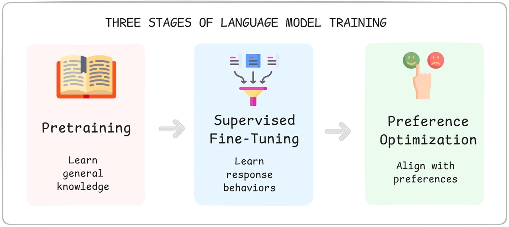

# Lesson Notes: Supervised Fine-Tuning (SFT) Roadmap

You've learned *how* models learn (next-token prediction, loss, and masking). This lesson provides the roadmap for **Supervised Fine-Tuning (SFT)**, explaining what it is, where it fits in the training pipeline, and the core concepts you'll need to master to perform it effectively.

## What is Supervised Fine-Tuning (SFT)?

**Supervised Fine-Tuning (SFT)** is the process of teaching a pretrained base model new *behaviors*.

A base model already understands language from its pretraining, but it doesn't know how to be a helpful assistant. It's a "text completer." SFT is what teaches it to follow instructions, answer questions, and format its responses in a specific style.

It uses the same "next-token prediction" mechanism as pretraining, but applies it to a curated, labeled dataset of examples.

* **Base Model (Pretrained):**
    * **Input:** "Write an email to my boss explaining..."
    * **Output (Completion):** "...the details of the new project and why it's important for..." (just continues the text)

* **SFT Model (Instruction-Tuned):**
    * **Input (Instruction):** "Write an email to your manager explaining you'll miss today's meeting."
    * **Output (Response):** "Hi [Manager], I wanted to let you know I'm feeling unwell and won't be able to attend today's meeting..." (follows the instruction)

SFT teaches the model the *pattern* that when it sees an instruction, it should produce a helpful, structured response.

### SFT vs. Pretraining

While the underlying mechanism (next-token prediction) is the same, SFT and pretraining are different in three key ways:

| Aspect | 1. Pretraining (Building the Engine) | 2. Supervised Fine-Tuning (Teaching to Drive) |
| :--- | :--- | :--- |
| **Starting Point** | Starts from **scratch** (random weights). | Starts from an **existing pretrained model**. |
| **Data** | Massive, raw, unlabeled text (e.g., trillions of tokens from the web). | Small, structured, labeled examples (e.g., 10k instruction-response pairs). |
| **Learning** | Learns from **every token** to understand language, grammar, and facts. | Typically **masks the instruction** and only learns from the *assistant's response* tokens. |

---

## Where SFT Fits: The 3 Stages of LLM Training

SFT is the critical second stage in the modern LLM pipeline, bridging the gap between a raw model and a helpful assistant.

1.  **Pretraining:**
    * **Goal:** Learn general language and world knowledge.
    * **Data:** Massive, unlabeled text (books, code, web).
    * **Result:** A **base model** (e.g., LLaMA 3, Mistral).

2.  **Supervised Fine-Tuning (SFT):**
    * **Goal:** Teach desired response behaviors and instruction-following.
    * **Data:** Curated, high-quality instruction-response pairs.
    * **Result:** An **instruction-tuned model**.

3.  **Preference Optimization:**
    * **Goal:** Align model outputs with human preferences (e.g., make it safer, funnier, or more concise).
    * **Data:** Ranked or scored completions (e.g., "Response A is better than Response B").
    * **Result:** A fully **aligned assistant** (e.g., GPT-4, Claude 3).

This program focuses on **Stage 2 (SFT)** because it's the most fundamental and powerful way to adapt a model for real-world tasks.

---

## Core Concepts for the SFT Workflow

Before you can run a fine-tuning job, you must understand the core engineering concepts that make it possible. The upcoming lessons will walk you through this exact workflow:

1.  **Dataset Preparation:** How to structure and organize your labeled examples (e.g., instruction-response pairs) into the format the model needs.
2.  **Tokenization and Padding:** The process of converting your text into numbers (tokens) and ensuring all sequences in a batch are the same length for efficient GPU processing.
3.  **Assistant-Only Masking:** The key technique to force the model to *only* learn from the assistant's replies, not from the user's prompts.
4.  **Data Types and Quantization:** Understanding `FP16`, `BF16`, and 8-bit/4-bit integers. This is essential for managing the massive memory (VRAM) requirements of LLMs.
5.  **PEFT (LoRA & QLoRA):** **Parameter-Efficient Fine-Tuning** methods. These are the modern techniques that allow you to fine-tune massive models (like 7B or 70B parameter models) on a single GPU by only updating a tiny, smart subset of the model's parameters.

Once you understand these pieces, fine-tuning stops being magic and becomes a repeatable engineering discipline.

---

## Acknowledgements

These notes are based on the "Supervised Fine-Tuning Roadmap" lesson from the **LLM Engineering & Deployment Certification Program** by **Ready Tensor**.