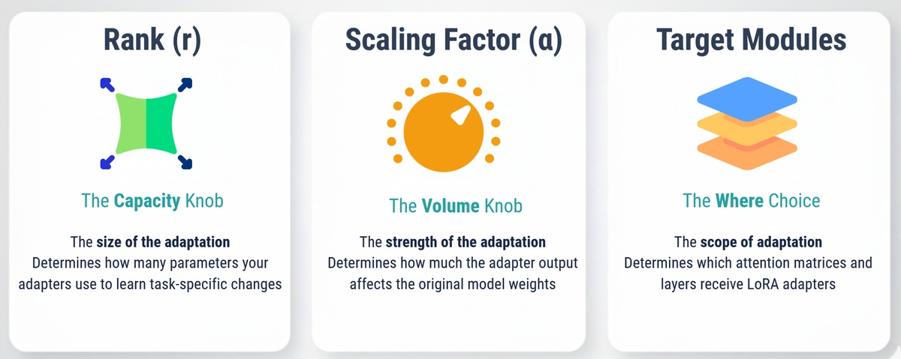

# Lesson Notes: LoRA and QLoRA for Efficient Fine-Tuning

You have learned all the building blocks of fine-tuning: next-token prediction, dataset prep, tokenization, masking, and data types (quantization). This lesson covers the practical breakthrough that ties it all together: **LoRA and QLoRA**.

These are the techniques that make it possible to fine-tune massive 7B or 70B parameter models on accessible, everyday hardware.

## The Accessibility Problem

Full fine-tuning (FFT), where you update every single parameter in a model, is extremely expensive.

* A 7B parameter model (like LLaMA 3 8B) requires **14 GB** of VRAM just to *store* the 16-bit model weights.
* During training, you also need to store gradients and optimizer states, easily pushing the total memory requirement to **40-50GB**.
* A 70B model would require **~300GB+**, which is completely out of reach for most developers.

This is the problem that **Parameter-Efficient Fine-Tuning (PEFT)** solves.

## What is Parameter-Efficient Fine-Tuning (PEFT)?

The core idea of PEFT is simple: a pretrained model *already knows* language, facts, and reasoning. You don't need to retrain everything; you just need to *nudge* it to learn your specific task or style.

PEFT methods work by **freezing the entire base model** (billions of parameters) and adding a tiny number of new, trainable parameters called **"adapters."**

Instead of training billions of parameters, you train a tiny fraction—sometimes as little as 0.1%—to achieve nearly the same performance.

---

## LoRA (Low-Rank Adaptation)

LoRA is the most popular PEFT method. It's based on the idea that the "change" a model needs to learn for a new task is small and can be represented efficiently.

### The Core Concept

1.  A model's "knowledge" is stored in its weight matrices (e.g., a `W` matrix). In FFT, you would update `W` directly.
2.  LoRA keeps `W` **frozen**.
3.  It adds two new, tiny "adapter" matrices, `A` and `B`, alongside `W`. These matrices are "low-rank," which means they have a very small inner dimension, `r`.
4.  The "change" to the model is represented by multiplying these two tiny matrices: **`ΔW = A x B`**.
5.  During **training**, only the `A` and `B` matrices (the adapters) are updated. The original `W` (billions of parameters) is never touched.
6.  During **inference**, the model's new effective weight is calculated on the fly: `W_effective = W + (A x B)`.


**Example:**
* A single `W` matrix might have **20 million** parameters (e.g., 5000 x 4000).
* If we use a common `rank (r) = 8`:
    * The `A` matrix (5000 x 8) has **40,000** parameters.
    * The `B` matrix (8 x 4000) has **32,000** parameters.
* **Result:** You train **72,000** parameters instead of **20,000,000**—a 99.6% reduction for that layer.

This massive parameter reduction means training uses a fraction of the VRAM for optimizer states and gradients.

---

## LoRA Hyperparameters: The "Knobs" You Control



You have three main "knobs" to tune LoRA's behavior.


### 1. Rank (r) - The "Capacity" Knob
* **What it is:** The inner dimension (`r`) of the adapter matrices (`A` and `B`).
* **Effect:** This is the most important knob. It controls the number of trainable parameters.
    * **Higher `r` (e.g., 64, 128):** More capacity to learn complex changes, but uses more memory and risks overfitting on small datasets.
    * **Lower `r` (e.g., 8, 16):** Less memory, trains faster, and is often all you need.
* **Default:** A `rank (r) = 8` is a very common and effective starting point.

### 2. Alpha (α) - The "Volume" Knob
* **What it is:** A scaling factor that controls how "strong" the adapter's change is.
* **Effect:** The LoRA paper suggests a simple rule of thumb: set **`alpha = 2 * r`**.
* **Example:** If `r = 8`, set `α = 16`. If `r = 16`, set `α = 32`. This keeps the adaptation strength consistent.

### 3. Target Modules - The "Where" Choice
* **What it is:** *Which* layers in the model get LoRA adapters?
* **Effect:** In Transformers, the most common practice is to target the attention layers:
    * `q_proj` (Query)
    * `v_proj` (Value)
* **Strategy:** Targeting just `q_proj` and `v_proj` works well for most instruction-following tasks. For more complex domain shifts, you can add more modules (like `k_proj`, `o_proj`, or the feed-forward layers) to increase capacity.

### 4. LoRA Dropout
* A standard dropout value (e.g., `0.05` or `0.1`) applied to the adapter layers to prevent overfitting, especially on small datasets.

#### A Good Starting Recipe for LoRA:
* `r = 8`
* `alpha = 16`
* `target_modules = ["q_proj", "v_proj"]`
* `lora_dropout = 0.05`

---

## QLoRA (Quantized Low-Rank Adaptation)

LoRA solved the problem of *trainable parameters*, but it didn't solve the *base model memory* problem. A 70B model still requires ~140GB of VRAM just to be *loaded*, even if it's frozen.

**QLoRA** solves this. It combines LoRA with the quantization techniques you learned in the previous lessons.

**How it Works:**
1.  **4-bit Quantization (NF4):** The massive, frozen base model is quantized from 16-bit down to **4-bit** using the optimized **NF4** (NormalFloat-4) data type. This cuts the memory for the base model by **75%**. (e.g., a 70B model drops from 140GB to ~35GB).
2.  **Double Quantization (DQQ):** The quantization *metadata* (the scales and zero-points for all the blocks) is *also* quantized to save even more memory (e.g., an extra ~0.9GB on a 7B model).
3.  **Paged Optimizers:** A smart memory management technique (like virtual RAM) that pages optimizer states to CPU RAM when the GPU VRAM gets full, preventing crashes.

**The QLoRA Training Flow:**
1.  The base model is **stored** in 4-bit NF4.
2.  When a layer is needed for a calculation, its weights are **de-quantized** on the fly to 16-bit (BF16).
3.  The forward and backward passes (the math) are performed in **stable 16-bit**.
4.  *Only* the LoRA adapters (which are kept in 16-bit) receive gradients and are updated.

This is the best of both worlds: you get the massive memory savings of 4-bit storage but the numerical stability of 16-bit computation. This is what allows a 70B model to be fine-tuned on a 48GB GPU.

---

## LoRA vs. QLoRA: When to Use Each

The choice is simple and based on your hardware constraints.

| Aspect | LoRA | QLoRA |
| :--- | :--- | :--- |
| **Base Model** | 16-bit (BF16 / FP16) | **4-bit Quantized (NF4)** |
| **Memory** | High (Base model is 16-bit) | **Very Low** (Base model is 4-bit) |
| **Speed** | **Faster** (No quant/dequant overhead) | Slightly Slower (10-20%) |
| **Performance** | Best Quality | ~90-95% of LoRA quality |

**Rule of Thumb:**
* **Use LoRA if:** The 16-bit base model *fits* in your VRAM (e.g., 7B model on a 24GB GPU). It will be faster.
* **Use QLoRA if:** The 16-bit base model *does not fit* (e.g., 13B+ model on a 24GB GPU, or 70B on a 48GB GPU). The memory savings are massive.

| Model Size | LoRA (16-bit) Memory | QLoRA (4-bit) Memory | Recommendation |
| :--- | :--- | :--- | :--- |
| **7B** | ~16GB | ~6GB | **LoRA** on 24GB GPU |
| **13B** | ~30GB | ~10GB | **QLoRA** on 24GB GPU |
| **33B** | ~70GB | ~20GB | **QLoRA** on 40GB GPU |
| **70B** | ~150GB | ~40GB | **QLoRA** on 48GB+ GPU |

---

## Implementation in Code

Using the `peft` and `bitsandbytes` libraries from Hugging Face makes this simple.

### LoRA Implementation
```python
from peft import LoraConfig, get_peft_model
from transformers import AutoModelForCausalLM

# 1. Load the model in 16-bit
model = AutoModelForCausalLM.from_pretrained(
    "meta-llama/Llama-2-7b-hf",
    torch_dtype=torch.bfloat16 # Load in 16-bit
)

# 2. Define LoRA config
lora_config = LoraConfig(
    r=8,
    lora_alpha=16,
    target_modules=["q_proj", "v_proj"],
    lora_dropout=0.05,
    task_type="CAUSAL_LM"
)

# 3. Wrap the model with PEFT
model = get_peft_model(model, lora_config)
model.print_trainable_parameters()
# Output: trainable params: 4,194,304 || all params: 6,742,609,920 || trainable%: 0.0622
```

### QLoRA Implementation
```python
from peft import LoraConfig, get_peft_model, prepare_model_for_kbit_training
from transformers import AutoModelForCausalLM, BitsAndBytesConfig
import torch

# 1. Define 4-bit Quantization config
bnb_config = BitsAndBytesConfig(
    load_in_4bit=True,
    bnb_4bit_quant_type="nf4",
    bnb_4bit_use_double_quant=True,
    bnb_4bit_compute_dtype=torch.bfloat16
)

# 2. Load the model WITH the 4-bit config
model = AutoModelForCausalLM.from_pretrained(
    "meta-llama/Llama-2-7b-hf",
    quantization_config=bnb_config, # Apply QLoRA config
    device_map="auto"
)

# 3. Prepare model for 4-bit training
model = prepare_model_for_kbit_training(model)

# 4. Define the SAME LoRA config
lora_config = LoraConfig(
    r=8,
    lora_alpha=16,
    target_modules=["q_proj", "v_proj"],
    lora_dropout=0.05,
    task_type="CAUSAL_LM"
)

# 5. Wrap the model with PEFT
model = get_peft_model(model, lora_config)
model.print_trainable_parameters()
# Output: trainable params: 4,194,304 || all params: 3,752,071,168 || trainable%: 0.1118
# Note: All params is smaller because the base model is 4-bit!
```

---

## Acknowledgements

These notes are based on the "LoRA and QLoRA: Parameter-Efficient Fine-Tuning for LLMs" lesson from the **LLM Engineering & Deployment Certification Program** by **Ready Tensor**.