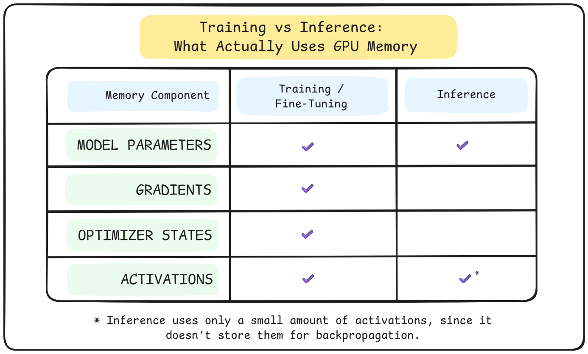

# Lesson Notes: LLM Memory Requirements (How Much GPU VRAM You Need)

This lesson addresses the single most common bottleneck in LLM engineering: **GPU Memory**.

While inference (running a model) is relatively cheap, training or fine-tuning is extremely expensive. A model that fits easily on your GPU for chat might crash instantly when you try to fine-tune it. This lesson provides the formula to calculate exactly why that happens.

## Why Memory Is Your First Scaling Problem

* **Inference vs. Training:** Inference only requires storing the model weights and a small amount of activation memory. Training requires storing weights, gradients, optimizer states, and massive activation maps.
* **The Hard Limit:** Unlike compute, which you can wait for (training takes longer), memory is a hard wall. If you exceed VRAM by even 1MB, the process crashes ("CUDA out of memory").

## The Four Components of Memory Consumption

When training, your GPU memory is consumed by four distinct buckets.

### 1. Model Parameters (The Weights)
These are the learned numbers that define the model. The memory they use depends strictly on precision.

| Precision | Bytes per Parameter | 1B Model Requirement |
| :--- | :--- | :--- |
| **FP32** | 4 bytes | 4 GB |
| **FP16 / BF16** | 2 bytes | 2 GB |
| **INT8** | 1 byte | 1 GB |

* **Formula:** $Memory_{params} = \text{Num Params} \times \text{Bytes per Param}$.

### 2. Gradients
During backpropagation, the model computes a gradient for every trainable parameter.
* These are typically stored in the same precision as the parameters.
* **Cost:** If training in FP32, gradients cost another **4 bytes per parameter**. If you freeze the model (like in LoRA), this cost drops to near zero for the frozen parts.

### 3. Optimizer States (The Hidden Cost)
This is often the largest memory consumer. Modern optimizers like **Adam** need to track statistics (momentum and variance) for every parameter to guide the training.
* **Standard Adam:** Tracks 2 states per parameter (Momentum + Variance).
* **Precision:** These states are almost always kept in **FP32** (4 bytes) for stability, even if you train in FP16.
* **Cost:** 2 states $\times$ 4 bytes = **8 bytes per parameter**.

### 4. Activations (The Forward Pass Footprint)
Activations are the intermediate outputs of every layer (attention scores, feed-forward outputs) generated during the forward pass. They must be stored to calculate gradients during the backward pass.
* **Scaling:** Unlike parameters, activation memory grows with **Batch Size** and **Sequence Length** (quadratically for attention).
* **Impact:** This is why doubling your context window can crash your training, even if the model size stays the same.

---

## Putting It Together: The Memory Formula

To calculate the total VRAM needed for **Full Fine-Tuning** (with Adam optimizer), use this mental model:

$$ \text{Total VRAM} \approx \text{Model Weights} + \text{Gradients} + \text{Optimizer States} + \text{Activations} $$

**Example: Training a 1B Parameter Model in FP32**
* **Model Weights:** 1B $\times$ 4 bytes = **4 GB**
* **Gradients:** 1B $\times$ 4 bytes = **4 GB**
* **Optimizer (Adam):** 1B $\times$ 8 bytes = **8 GB**
* **Activations:** (Variable, roughly 1GB for small batches) = **~1 GB**
* **Total:** **~17 GB**

**Key Insight:** A 1B model that only takes **4 GB** to load requires **~17 GB** to train. This 4x-5x multiplier is why memory planning is critical.

## What Comes Next: Alleviating the Bottleneck

Since memory is the primary constraint, engineers use specific tools to "cheat" these limits. Future lessons will cover:
* **Gradient Accumulation:** Simulating a large batch size without the memory cost.
* **Activation Checkpointing:** Trading compute for memory by deleting activations and re-calculating them during the backward pass.
* **FSDP (Fully Sharded Data Parallel):** Sharding the model parameters and optimizer states across multiple GPUs so no single GPU holds the whole model.

---

## Acknowledgements

These notes are based on the "LLM Memory Requirements" lesson from the **LLM Engineering & Deployment Certification Program** by **Ready Tensor**.